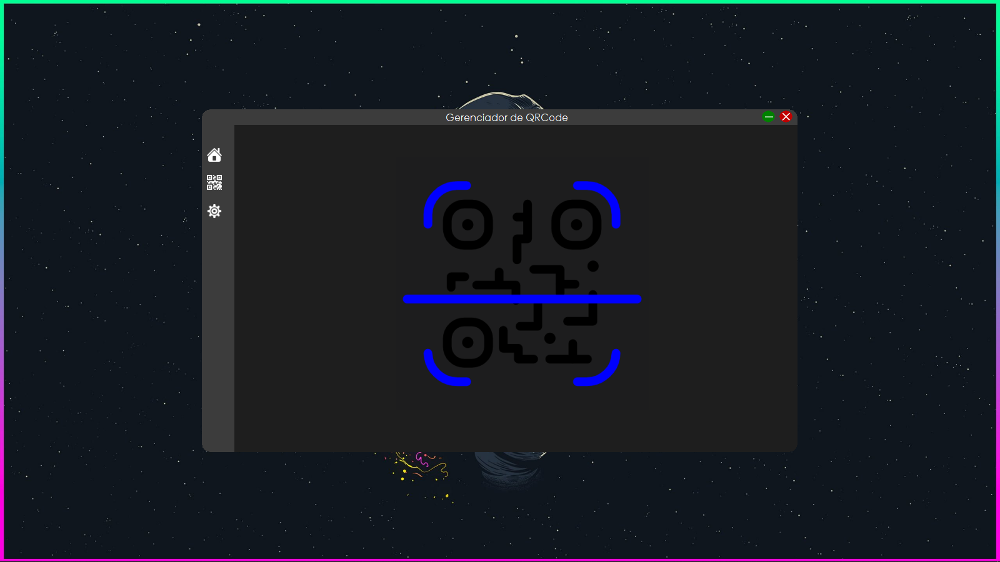
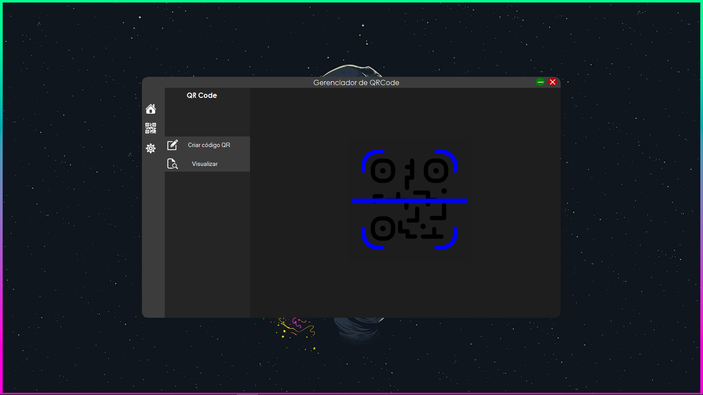
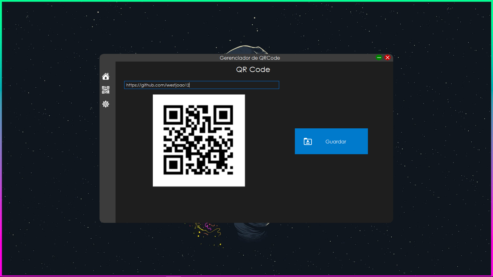
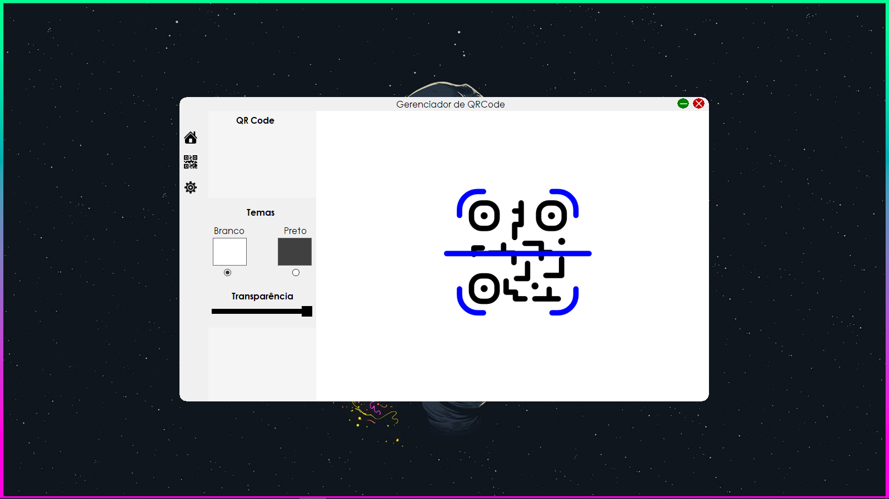

# Gerenciador QRCode

💫Create and scan your QR code.
 💫Crie e faça leitura do seu código QR.

## Description
- This project was created for study purposes, as a way to increase my knowledge on the .NET platform and also github being the focus, its Markdown language
- Este projecto foi criado para fins de estudos, como forma de aumentar os meus conhecimentos na plataforma .NET e também github sendo o foco, a sua linguagem Markdown

## 🛠Tools
- Made with C#, WinForms + Bunifu UI 
- Feito com C#, WinForms + Bunifu UI

## Layout

- Home screen
- Tela Inicial

- Choose between generating a new Qr or viewing an existing.
- Escolher entre gerar um Qr ou visualizar um já existente.

- Generate a new Qr Code.
- Gerar um novo Qr Code.

- View information from a generated Qr Code.
- Visualizar informação de um Qr Code gerado.

- Choose between White and Black theme.
- Escolher entre tema Branco e Preto.

- White Theme 
- Tema Branco
